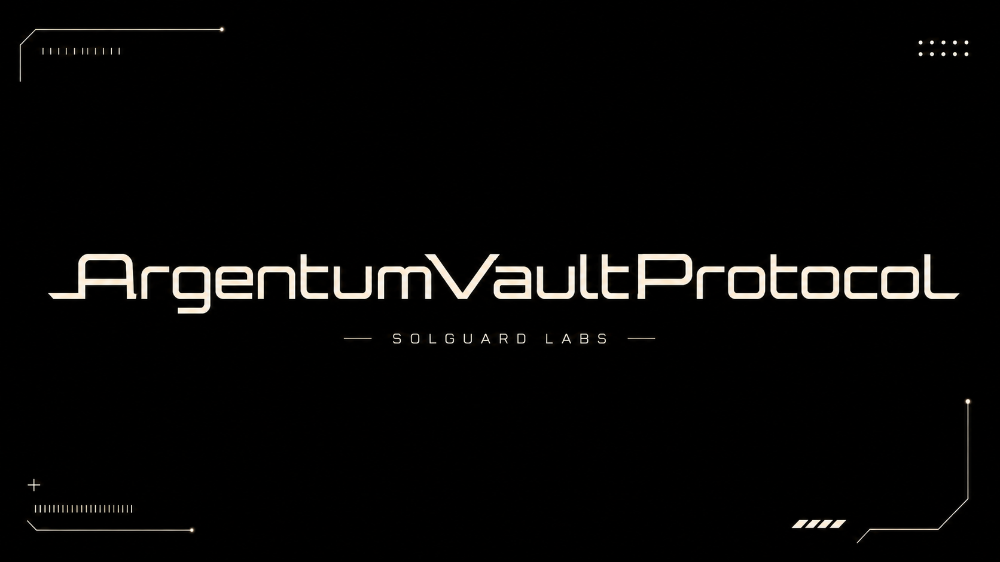
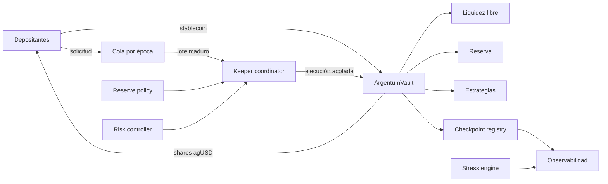
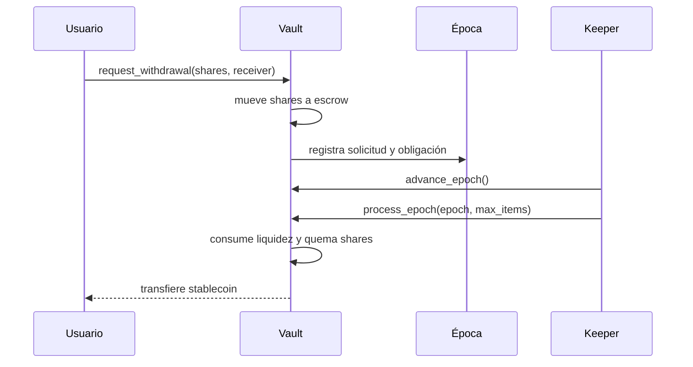

# ArgentumVaultProtocol



ArgentumVaultProtocol es una infraestructura de tesorería en Vyper para
stablecoins con participaciones fungibles, salidas agrupadas por épocas,
reservas internas y capital gestionado por estrategias. El sistema separa la
contabilidad del vault, las políticas de riesgo, la coordinación operativa y la
observabilidad para que cada responsabilidad pueda gobernarse y verificarse de
forma independiente.

[](https://github.com/SolguardLabs/ArgentumVaultProtocol/actions/workflows/ci.yml)
[](https://github.com/SolguardLabs/ArgentumVaultProtocol/actions/workflows/release-integrity.yml)


## Arquitectura



El vault emite shares contra el NAV y organiza las solicitudes en una época
futura. El keeper procesa una cantidad máxima de elementos y consume primero
liquidez libre y después reserva. La política de reserva, el controlador de
riesgo y el motor de estrés ofrecen decisiones deterministas para la capa
operativa; el registro de checkpoints encadena estados contables aprobados por
quórum.

## Componentes

| Componente | Responsabilidad |
| --- | --- |
| `ArgentumVault` | Depósitos, shares, cola, lotes, NAV, reserva y estrategias |
| `ArgentumReservePolicy` | Objetivos, buffers, límites de disposición y recalls |
| `ArgentumRiskController` | Concentración, liquidez, presión de cola y límites de pérdida |
| `ArgentumKeeperCoordinator` | Ventanas, asignación y cierre de trabajos operativos |
| `ArgentumStressEngine` | Proyecciones de liquidez y severidad bajo escenarios compuestos |
| `ArgentumCheckpointRegistry` | Compromisos contables hash-linked y aprobación por quórum |
| `ArgentumParameterStore` | Parámetros acotados con demora de gobierno |
| `ArgentumEpochLedger` | Espejo de solicitudes y liquidaciones por época |
| `ArgentumLens` | Lecturas agregadas para clientes y paneles |
| `ArgentumWithdrawalRouter` | Integración delegada de solicitudes y receptores |
| `client/` | Cliente Python tipado y planificador de lotes |

## Modelo económico

Para activos totales `A`, oferta `S` y shares `x`, el precio interno y la
conversión base son:

```text
PPS = A · 10¹⁸ / S
assets(x) = x · PPS / 10¹⁸
reserve_target = max(reserve_floor, A · reserve_target_bps / 10_000)
```

La liquidez contable satisface:

```text
A = free_liquidity + reserve_liquidity + strategy_assets
```

El motor de estrés aplica pérdida, recall y presión de cola en el mismo orden
que usa el equipo de operaciones para estimar cobertura y reserva posterior.
Los detalles, supuestos y ejemplos se encuentran en
[`docs/modelo-economico.md`](./docs/modelo-economico.md).

## Flujo de una solicitud



## Inicio rápido

Requisitos: Python 3.12 y un entorno con `bash` o PowerShell.

```bash
python -m venv .venv
source .venv/bin/activate
python -m pip install -r requirements.txt
bash scripts/ci.sh
```

En Windows:

```powershell
py -3.12 -m venv .venv
.\.venv\Scripts\python.exe -m pip install -r requirements.txt
.\scripts\ci.ps1
```

Ejemplo del cliente de lectura:

```python
from client import ArgentumClient

client = ArgentumClient(vault_contract)
snapshot = client.snapshot()
plan = client.plan_epoch(
    pending_assets=250_000_000000,
    free_liquidity=snapshot.free_liquidity,
    reserve_liquidity=snapshot.reserve_liquidity,
    reserve_buffer=100_000_000000,
)
print(plan.recall_required)
```

## Garantías comprobadas

La suite despliega bytecode real con titanoboa y cubre:

- emisión y transferencias de shares;
- madurez y cursor de épocas;
- procesamiento por lotes y consumo ordenado de liquidez;
- capacidad, pausas independientes y límites de solicitudes;
- rotación de propietario en dos pasos;
- límites de reportes de estrategia;
- gobierno acotado por timelock;
- escenarios compuestos de liquidez;
- checkpoints hash-linked con quórum;
- planificación del cliente Python.

## Documentación

- [Arquitectura](./docs/arquitectura.md)
- [Modelo económico](./docs/modelo-economico.md)
- [Modelo de seguridad](./docs/modelo-seguridad.md)
- [Gobierno](./docs/gobierno.md)
- [Operaciones](./docs/operaciones.md)
- [Integración](./docs/integracion.md)
- [Despliegue](./docs/despliegue.md)

## Estado de versión

`v1.0.0` define la primera línea estable: contratos Vyper 0.4.3, cliente
Python 3.12 y artefactos reproducibles. Las direcciones de cada red deben
publicarse en un manifiesto independiente y verificarse antes de integrar.

## Licencia

[MIT](./LICENSE) © 2026 SolguardLabs.
