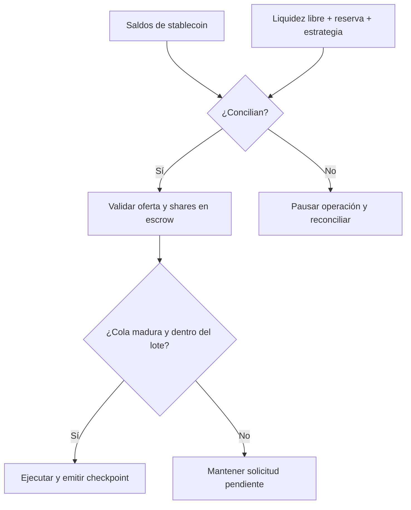

# Política de seguridad

ArgentumVaultProtocol aplica defensa por capas sobre custodia, contabilidad,
operación y gobierno. Los controles auxiliares no sustituyen la verificación de
las transiciones del vault: cada integración debe validar roles, parámetros,
direcciones y estado contable antes de ejecutar acciones.

## Versiones mantenidas

| Versión | Estado |
| --- | --- |
| `1.0.x` | Mantenida |
| `< 1.0.0` | Sin mantenimiento |

## Alcance técnico

Se aceptan reportes sobre contratos en `src/`, cliente en `client/`, scripts de
despliegue y automatización de release. Dependencias de terceros, mocks,
credenciales expuestas por terceros y configuraciones ajenas al repositorio no
forman parte del alcance.

## Invariantes críticas

- `total_assets` debe igualar la suma de los tres compartimentos contables.
- La oferta no puede ser inferior a los shares mantenidos en escrow.
- Cada solicitud se procesa una sola vez y dentro de su época madura.
- El cursor de una época sólo avanza y el tamaño de lote no supera `128`.
- Las operaciones privilegiadas deben proceder del rol configurado.
- Los parámetros sensibles se aplican dentro de límites publicados y con la
  demora de gobierno correspondiente.
- Un checkpoint final necesita el quórum activo y enlaza el hash final previo.

## Gestión de incidentes

1. Pausar depósitos y solicitudes si la conciliación no es determinista.
2. Detener nuevas asignaciones y conservar los logs del último checkpoint.
3. Comparar saldo real, liquidez contable, obligaciones y oferta.
4. Preparar la acción correctiva mediante el flujo de gobierno.
5. Reanudar únicamente tras dos snapshots consecutivos conciliados.

No publiques información sensible en issues. Usa la pestaña **Security** del
repositorio para abrir un aviso privado e incluye versión, red, transacción o
estado reproducible, impacto estimado y una prueba mínima. Se acusará recibo en
72 horas y se comunicará la clasificación inicial en siete días naturales.

Consulta [el modelo de seguridad](./docs/modelo-seguridad.md) y
[el runbook operativo](./docs/operaciones.md) antes de administrar una instancia.
