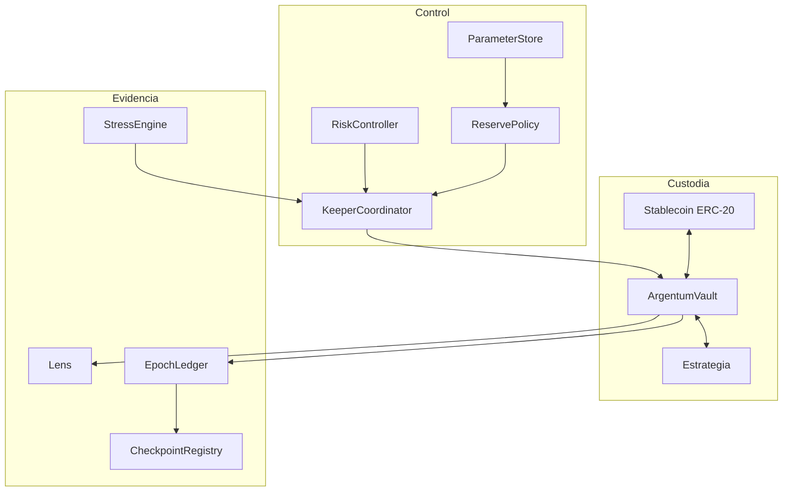

# Arquitectura

## Límites del sistema

Argentum separa custodia, política y observabilidad. `ArgentumVault` es la única
pieza que mantiene activos y shares; los demás contratos calculan, coordinan o
registran información. Esta separación reduce el número de dependencias dentro
de las rutas que transfieren fondos.

## Estado principal

El vault mantiene `free_liquidity`, `reserve_liquidity` y `strategy_assets`.
Los depósitos entran en reserva hasta alcanzar el objetivo y el resto se
clasifica como liquidez libre. Las asignaciones trasladan contabilidad desde el
compartimento libre a estrategias. Los retornos ejecutan el camino inverso.

Cada solicitud contiene propietario, receptor, época, shares, importe cotizado,
PPS de registro, marcas temporales y estado. `EpochState` agrega rango de IDs,
cursor, pendientes, pagos, recuento y cierre.

## Confianza y responsabilidades

| Rol | Puede | No debe |
| --- | --- | --- |
| Owner | Rotar roles y configurar límites | Operar con una clave personal |
| Keeper | Avanzar y procesar épocas | Modificar parámetros de gobierno |
| Strategist | Asignar, retornar y reportar capital | Procesar solicitudes |
| Reporter | Proponer o aprobar checkpoints | Mover activos |
| Usuario | Depositar, transferir y solicitar salida | Alterar el orden de la cola |

El owner debe ser una cuenta con política multifirma. Keeper y strategist deben
ser identidades separadas. Los reporters de checkpoints no deben compartir la
misma infraestructura de firma.

## Dependencias

La línea estable fija Vyper `0.4.3`, titanoboa `0.2.8` y pytest `9.1.1`.
El cliente Python no introduce dependencias de ejecución. Los contratos sólo
interactúan con el activo y, de forma controlada, con estrategias o vaults de
confianza.
