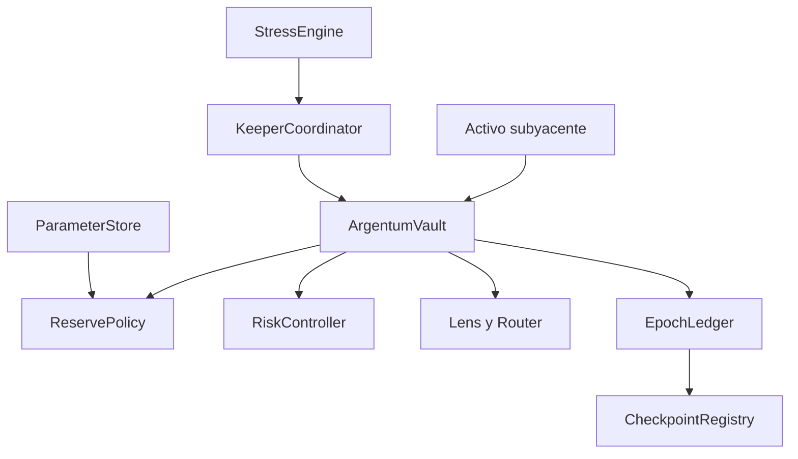

# Despliegue

## Orden recomendado



1. Fijar compilador y dependencias según `requirements.txt`.
2. Desplegar el activo o verificar su dirección y decimales.
3. Desplegar vault con owner, keeper y strategist separados.
4. Desplegar políticas, store, coordinador, lens, router y contabilidad.
5. Autorizar vaults y reporters; establecer quórum.
6. Inicializar parámetros con límites y demora.
7. Ejecutar depósito mínimo, solicitud, avance y procesamiento controlado.
8. Emitir el primer checkpoint y publicar el manifiesto.

## Manifiesto

El manifiesto de red debe contener chain ID, bloque de despliegue, direcciones,
hash de bytecode, argumentos, roles, parámetros, commit y tag. No se almacenan
claves ni RPC privados en el repositorio.

## Verificación local

```bash
bash scripts/ci.sh
```

La CI compila todos los `.vy`, ejecuta la suite pública y comprueba que no haya
archivos privados o caches versionados. El tag de release debe señalar el mismo
commit que `main` y `production`.
