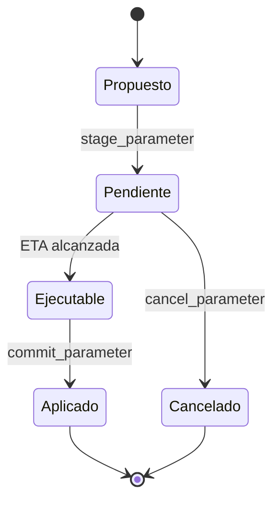

# Gobierno

## Ciclo de cambio

Cada parámetro se inicializa con valor y límites. Una nueva propuesta fuera de
esos límites se rechaza antes de programarse. El delay admitido está entre una
hora y treinta días; modificar el propio delay requiere el mismo control owner
y debe registrarse en el procedimiento de cambios.

## Parámetros recomendados

| Clave | Unidad | Propósito |
| --- | --- | --- |
| `reserve_target_bps` | bps | Reserva objetivo sobre activos |
| `reserve_floor` | activo | Mínimo absoluto de reserva |
| `withdrawal_delay_epochs` | épocas | Madurez de nuevas solicitudes |
| `max_batch` | elementos | Cota de procesamiento por transacción |
| cap de estrategia | bps | Concentración por destino |

## Procedimiento

1. Tomar snapshot y ejecutar escenarios de estrés.
2. Publicar el valor, unidad, límites, ETA y motivación operativa.
3. Simular el cambio con el estado vigente.
4. Programar mediante el store y verificar el evento.
5. Tras la ETA, volver a simular y ejecutar.
6. Emitir checkpoint y comparar ratios esperados.

La rotación del owner se inicia desde la identidad vigente y se acepta desde la
nueva. Nunca debe considerarse completa hasta observar `OwnershipTransferred`.
