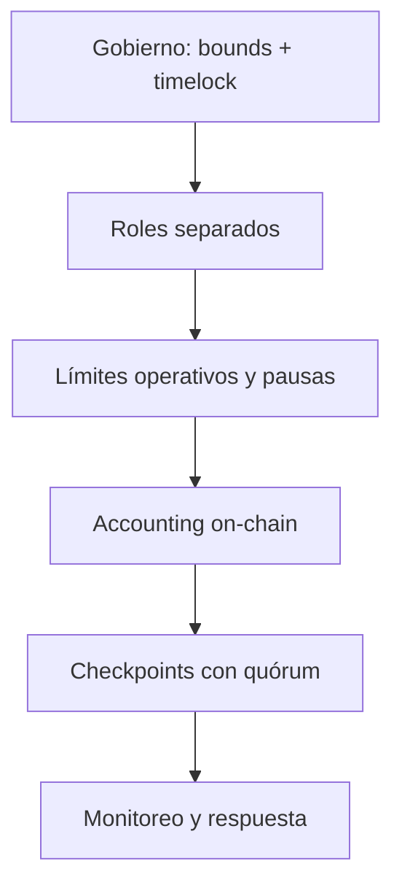

# Modelo de seguridad

## Objetivos

El sistema prioriza custodia íntegra, contabilidad conciliable, disponibilidad
acotada de salidas y cambios de gobierno observables. Se asume que el token
subyacente cumple su interfaz y que los roles privilegiados pueden degradarse,
por lo que se minimiza el alcance de cada uno.

## Capas

### Gobierno

`ArgentumParameterStore` registra límites inferior y superior para cada clave.
Una propuesta queda pendiente hasta su ETA. La propiedad del vault se transfiere
en dos pasos para evitar rotaciones a una dirección incorrecta.

### Operación

Depósitos y solicitudes disponen de pausas independientes. Los caps de TVL,
solicitud y pérdida por reporte evitan cambios no acotados. La coordinación de
keepers define responsable, ventana y tamaño máximo por trabajo.

### Evidencia contable

Cada checkpoint compromete época, activos, oferta, liquidez, pendientes, payload
externo y hash previo. Un reporter propone y otros aprueban hasta alcanzar el
quórum. La cadena resultante permite detectar divergencias entre observadores.

## Matriz de controles

| Riesgo operativo | Prevención | Detección | Respuesta |
| --- | --- | --- | --- |
| Clave owner degradada | Multifirma y timelock | Eventos de parámetros | Cancelar pendiente, rotar roles |
| Keeper fuera de ventana | Job con ETA/deadline | Estado de job | Reasignar trabajo |
| Estrategia concentrada | Caps por estrategia/global | Stress engine | Recall y bloqueo de asignación |
| Reserva bajo mínimo | Política soft/hard | Ratio y checkpoint | Pausar, recall, reequilibrar |
| Descuadre contable | Asserts y snapshot | Conciliación independiente | Pausa y reconstrucción |
| Reporter divergente | Quórum y hash previo | Hashes incompatibles | Revocar reporter |

## Supuestos de integración

- El activo no aplica fees silenciosas en `transfer` o `transferFrom`.
- Las estrategias retornan tokens antes de registrar el retorno.
- La automatización simula transacciones contra el bloque más reciente.
- Las direcciones se verifican contra un manifiesto firmado.
- Las claves de owner, keeper, strategist y reporter son independientes.
