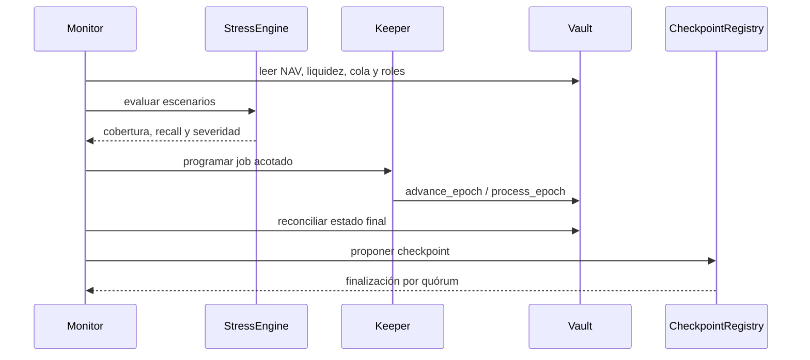

# Operaciones

## Ciclo de época

## Checklist previa

- La dirección del vault coincide con el manifiesto de red.
- `total_assets` reconcilia con sus tres compartimentos.
- El saldo real del token no es inferior a la liquidez contable.
- Owner, keeper y strategist son los esperados.
- La época objetivo está madura y tiene elementos pendientes.
- El lote respeta el cap y el presupuesto de gas.
- La reserva posterior permanece dentro del umbral aprobado.

## Estados de reserva

`0` saludable, `1` bajo objetivo, `2` cruce del mínimo soft y `3` cruce del
mínimo hard. Un estado hard bloquea nuevas disposiciones de reserva en la
política. El modo de emergencia bloquea toda disposición aunque exista saldo.

## Respuesta a desviaciones

1. Registrar bloque, transacción, saldos y último checkpoint.
2. Pausar depósitos o solicitudes según la superficie afectada.
3. Suspender asignaciones nuevas.
4. Calcular recall necesario preservando el buffer.
5. Reconciliar el retorno recibido antes de anotarlo en el vault.
6. Emitir dos checkpoints consecutivos consistentes antes de reanudar.

## Métricas mínimas

`liquid_ratio_bps`, `reserve_ratio_bps`, `strategy_ratio_bps`, obligaciones,
pendientes por época, edad del cursor, uso de reserva, jobs vencidos y diferencia
entre saldo real y saldo contable. Toda alerta debe incluir red, bloque y unidad.
